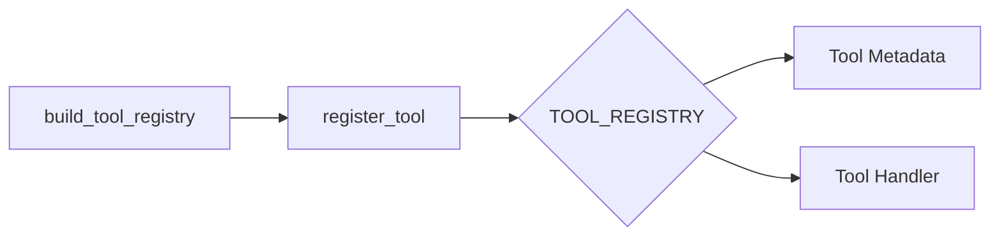
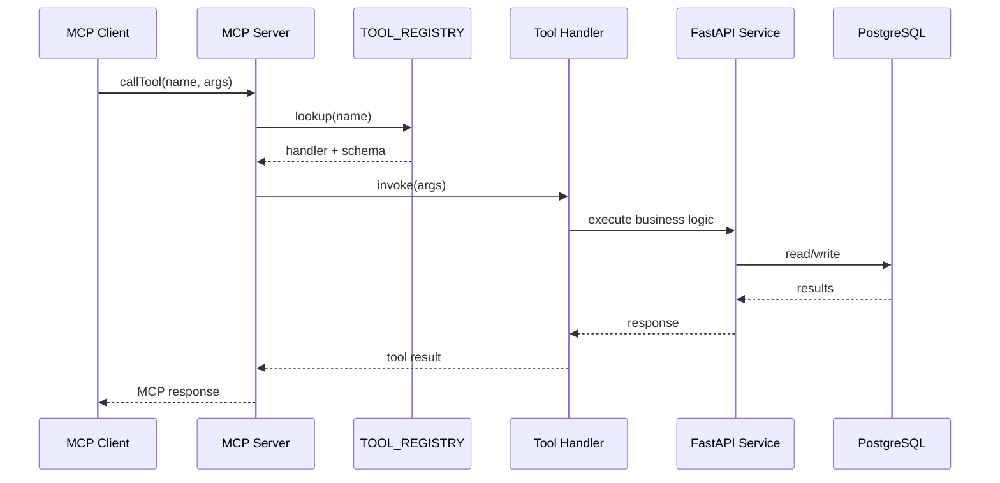

# MCP Tool Registry Architecture

This document explains how AristAI's MCP server organizes, registers, and routes tools, and how those tools map to the underlying FastAPI services.

## Overview

The MCP server centralizes all tool definitions in a single registry so that MCP clients (Claude Desktop, voice agents, etc.) can discover and invoke capabilities consistently. Each tool is defined with:

- **Name**: the MCP tool identifier (e.g., `list_courses`)
- **Description**: a human-readable summary
- **Parameters**: JSON schema used for validation and MCP tool docs
- **Handler**: the Python callable that executes the request
- **Mode**: `read` or `write` for confirmation policy
- **Category**: logical grouping (courses, sessions, forum, polls, copilot, reports, enrollment, navigation)

The registry is built once at startup and then reused for MCP `listTools` and `callTool` requests.

## High-Level Flow

```mermaid
flowchart TD
    A[MCP Client\n(Claude Desktop / Voice Agent)] -->|listTools/callTool| B[MCP Server\nserver.py]
    B --> C[Tool Registry\nTOOL_REGISTRY]
    C -->|dispatch| D[Tool Handlers\n(mcp_server/tools/*)]
    D --> E[FastAPI Services\n(api/*)]
    E --> F[(PostgreSQL)]
    E --> G[(Redis/Celery)]
```

## Registry Construction

The registry is populated by `build_tool_registry()` inside `mcp_server/server.py`, which calls `register_tool()` for every tool across modules. This ensures:

1. **Centralized metadata** for all MCP tools.
2. **Consistent parameter schema** for tooling and validation.
3. **Single dispatch point** for `callTool` requests.



## Module-to-Category Map

| Module | Category | Examples |
| --- | --- | --- |
| `courses.py` | `courses` | `list_courses`, `create_course` |
| `sessions.py` | `sessions` | `list_sessions`, `go_live` |
| `forum.py` | `forum` | `create_post`, `pin_post` |
| `polls.py` | `polls` | `create_poll`, `get_poll_results` |
| `copilot.py` | `copilot` | `start_copilot`, `get_copilot_suggestions` |
| `reports.py` | `reports` | `generate_report`, `get_report_summary` |
| `enrollment.py` | `enrollment` | `enroll_student`, `get_enrolled_students` |
| `navigation.py` | `navigation` | `get_current_page`, `navigate_to` |

## Request Dispatch

When a `callTool` request arrives:

1. The MCP server looks up the tool by name in `TOOL_REGISTRY`.
2. The tool handler receives validated parameters.
3. The handler opens a database session (via `get_db()` in `server.py`).
4. The handler calls into the FastAPI service layer (or direct models) to fulfill the request.
5. The result is returned as an MCP response with a human-readable message plus structured data.



## Extending the Registry

To add a new tool:

1. Implement handler in the relevant module under `mcp_server/tools/`.
2. Register it in `build_tool_registry()` with the appropriate metadata.
3. Update any MCP client docs if needed (e.g., README or voice examples).

Keeping the metadata co-located in `server.py` ensures the MCP server remains a single source of truth for tool definitions and discovery.
